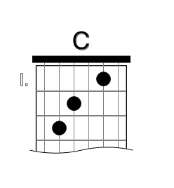
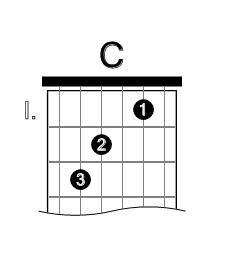
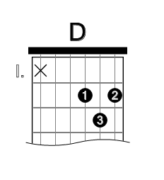
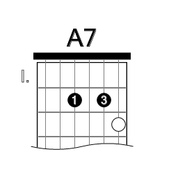
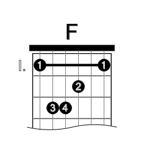
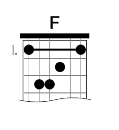
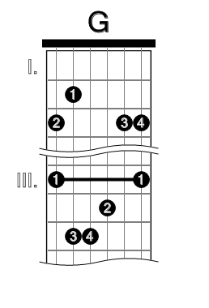
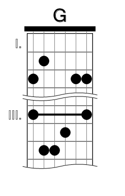

# XChords 

Standalone tool and Java library for guitar chords representation, manipulation and presentation.

XChords converts XML guitar chord definitions to SVG (Scalable Vector Graphics) images and then further to JPEG/PNG/TIFF/PDF/HTML documents. Project includes XML Schema and/or DTD. It uses XSLT as the main engine (XML->XSLT->SVG).

There is also a possibility to generate just plain text chord information ( something like C:032010 ).

List of companion projects:

[XSong](https://github.com/miira/xsong)
[RoboTarPC](https://github.com/kleekru/RoboTarPC)

# How does it work

**Command line tool** can be run with (requirements: `JRE/JDK` and `ant`):

	ant svg -Dparam.archive=basic
	
It looks for chord library `basic` (bundled) and transforms all chords there into SVG files.

**Java classes** can be used to model guitar chords in your application, with dynamic transformation into `String` with SVG content. It can be further displayed with your favorite SVG library. I successfully used *SVG Salamander* library, when I was embedding XChords into the RoboTarPC project.

# Examples

## Plain chord

Prepare chord definition

	<chord id="basic-C">
		<name>C</name>
		<position base="1">
			<string name="a" fret="3"/>
			<string name="d" fret="2"/>
			<string name="b" fret="1"/>
		</position>
	</chord>
	
XChords XSL will transform it to this SVG (screenshot):

## Chord with fingers

	<chord id="basic-C">
		<name>C</name>
		<position base="1">
			<string name="a" fret="3" finger="3"/>
			<string name="d" fret="2" finger="2"/>
			<string name="b" fret="1" finger="1"/>
		</position>
	</chord>
	

## Don't play this string
	
	<chord id="basic-D">
		<name>D</name>
		<position base="1">
			<string name="e6" state="no"/>
			<string name="g" fret="2" finger="1"/>
			<string name="b" fret="3" finger="3"/>
			<string name="e1" fret="2" finger="2"/>
		</position>
	</chord>

## Optional fret ##

	<chord id="basic-A7">
		<name>A7</name>
		<position base="1">
			<string name="d" fret="2" finger="1"/>
			<string name="b" fret="2" finger="3"/>
			<string name="e1" fret="3" state="opt"/>
		</position>
	</chord>

## Barre

	<chord id="basic-F">
		<name>F</name>
		<position base="1">
			<barre low="e6" high="e1" fret="1" finger="1"/>
			<string name="a" fret="3" finger="3"/>
			<string name="d" fret="3" finger="4"/>
			<string name="g" fret="2" finger="2"/>
		</position>
	</chord>
	
With or without fingers:

## Multiple positions

The `position` element finally reveals its role.

	<chord id="basic-G">
		<name>G</name>
		<position name="first" base="1">
			<string name="e6" fret="3" finger="2"/>
			<string name="a" fret="2" finger="1"/>
			<string name="b" fret="3" finger="3"/>
			<string name="e1" fret="3" finger="4"/>
		</position>
		<position name="third" base="3">
			<barre low="e6" high="e1" fret="3" finger="1"/>
			<string name="a" fret="5" finger="3"/>
			<string name="d" fret="5" finger="4"/>
			<string name="g" fret="4" finger="2"/>
		</position>
	</chord>
	

# History 

* started:          25.6.2003
* current version:  0.4
* license:          LGPL (Lesser General Public License)
* repository:       https://github.com/miira/xchords
* old homepage:     http://xchords.sourceforge.net

If you would like to see more future versions and features, please, donate this project. Thank you. 

